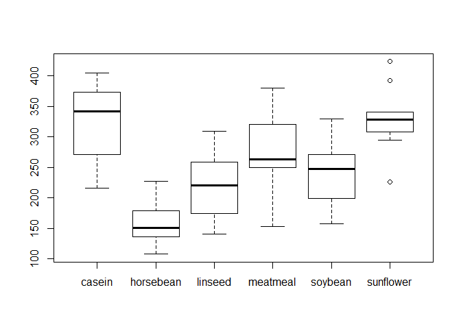
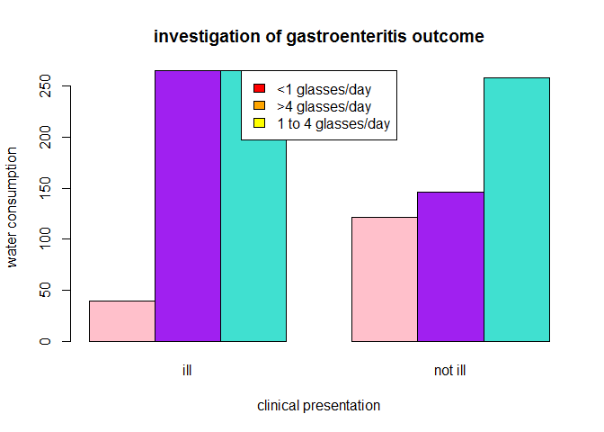
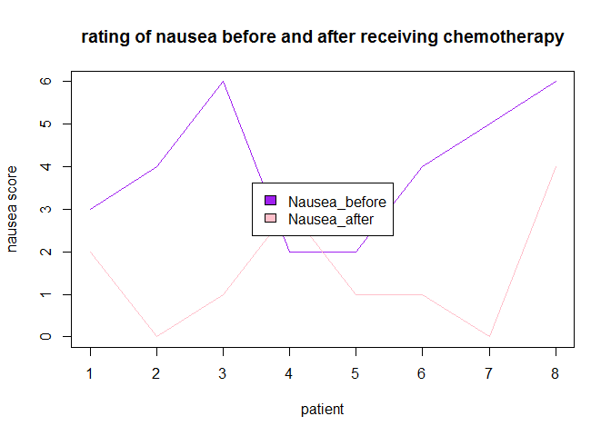
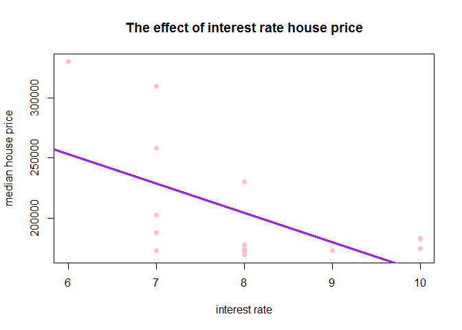
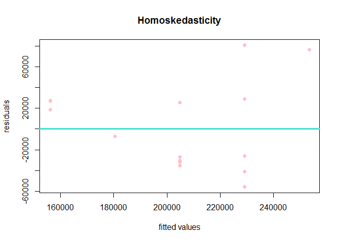
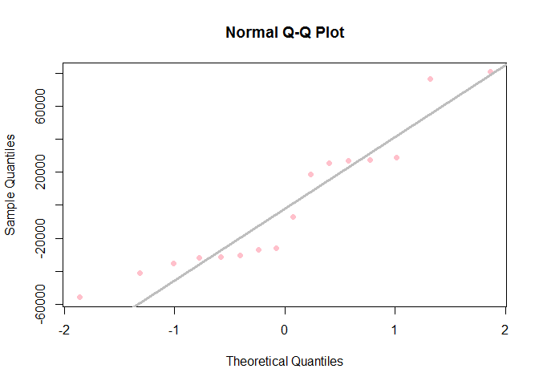

Assignment 1-6
================
Luyolo Matutu

Assignment 1
------------

Hello Octocat
-------------

I love Octocat. She's the coolest cat in town. 

GitHub Documents
----------------

This is an R Markdown format used for publishing markdown documents to GitHub. When you click the **Knit** button all R code chunks are run and a markdown file (.md) suitable for publishing to GitHub is generated.

Including Code
--------------

You can include R code in the document as follows:

Including Plots
---------------

You can also embed plots, for example:


Note that the `echo = FALSE` parameter was added to the code chunk to prevent printing of the R code that generated the plot. \#\# Assignment 2

``` r
# R dataset
data("anscombe")
dim(anscombe)
```

    ## [1] 11  8

``` r
names(anscombe)
```

    ## [1] "x1" "x2" "x3" "x4" "y1" "y2" "y3" "y4"

``` r
head(anscombe, n=6)
```

    ##   x1 x2 x3 x4   y1   y2    y3   y4
    ## 1 10 10 10  8 8.04 9.14  7.46 6.58
    ## 2  8  8  8  8 6.95 8.14  6.77 5.76
    ## 3 13 13 13  8 7.58 8.74 12.74 7.71
    ## 4  9  9  9  8 8.81 8.77  7.11 8.84
    ## 5 11 11 11  8 8.33 9.26  7.81 8.47
    ## 6 14 14 14  8 9.96 8.10  8.84 7.04

``` r
tail(anscombe, n=6)
```

    ##    x1 x2 x3 x4    y1   y2   y3    y4
    ## 6  14 14 14  8  9.96 8.10 8.84  7.04
    ## 7   6  6  6  8  7.24 6.13 6.08  5.25
    ## 8   4  4  4 19  4.26 3.10 5.39 12.50
    ## 9  12 12 12  8 10.84 9.13 8.15  5.56
    ## 10  7  7  7  8  4.82 7.26 6.42  7.91
    ## 11  5  5  5  8  5.68 4.74 5.73  6.89

``` r
summary(anscombe)
```

    ##        x1             x2             x3             x4    
    ##  Min.   : 4.0   Min.   : 4.0   Min.   : 4.0   Min.   : 8  
    ##  1st Qu.: 6.5   1st Qu.: 6.5   1st Qu.: 6.5   1st Qu.: 8  
    ##  Median : 9.0   Median : 9.0   Median : 9.0   Median : 8  
    ##  Mean   : 9.0   Mean   : 9.0   Mean   : 9.0   Mean   : 9  
    ##  3rd Qu.:11.5   3rd Qu.:11.5   3rd Qu.:11.5   3rd Qu.: 8  
    ##  Max.   :14.0   Max.   :14.0   Max.   :14.0   Max.   :19  
    ##        y1               y2              y3              y4        
    ##  Min.   : 4.260   Min.   :3.100   Min.   : 5.39   Min.   : 5.250  
    ##  1st Qu.: 6.315   1st Qu.:6.695   1st Qu.: 6.25   1st Qu.: 6.170  
    ##  Median : 7.580   Median :8.140   Median : 7.11   Median : 7.040  
    ##  Mean   : 7.501   Mean   :7.501   Mean   : 7.50   Mean   : 7.501  
    ##  3rd Qu.: 8.570   3rd Qu.:8.950   3rd Qu.: 7.98   3rd Qu.: 8.190  
    ##  Max.   :10.840   Max.   :9.260   Max.   :12.74   Max.   :12.500

Assignment 3
------------


Assignment 4
------------

Chunk 4
=======

``` r
# packages to read data for all chunks
library(readr)
library(dplyr)
```

    ## 
    ## Attaching package: 'dplyr'

    ## The following objects are masked from 'package:stats':
    ## 
    ##     filter, lag

    ## The following objects are masked from 'package:base':
    ## 
    ##     intersect, setdiff, setequal, union

``` r
library(tidyr)

#read data from analgesic.csv file
df<-read.csv("analgesic (1).csv")
```

Chunk 5
=======

    ## [1] 40  5

    ## [1] "ID"            "Group"         "Measurement_1" "Measurement_2"
    ## [5] "Measurement_3"

    ##   ID     Group Measurement_1 Measurement_2 Measurement_3
    ## 1  1 Analgesic            26            26            21
    ## 2  2 Analgesic            29            26            23
    ## 3  3 Analgesic            24            28            22
    ## 4  4 Analgesic            25            22            24
    ## 5  5 Analgesic            24            28            23
    ## 6  6 Analgesic            22            23            26

    ##    ID   Group Measurement_1 Measurement_2 Measurement_3
    ## 35 35 Placebo            17            21            15
    ## 36 36 Placebo            19            17            15
    ## 37 37 Placebo            14            19            13
    ## 38 38 Placebo            17            19            13
    ## 39 39 Placebo            11            20            18
    ## 40 40 Placebo            15            18            12

    ##        ID              Group    Measurement_1   Measurement_2 
    ##  Min.   : 1.00   Analgesic:20   Min.   :10.00   Min.   : 8.0  
    ##  1st Qu.:10.75   Placebo  :20   1st Qu.:17.00   1st Qu.:17.0  
    ##  Median :20.50                  Median :20.00   Median :20.0  
    ##  Mean   :20.50                  Mean   :20.12   Mean   :20.7  
    ##  3rd Qu.:30.25                  3rd Qu.:24.00   3rd Qu.:25.0  
    ##  Max.   :40.00                  Max.   :30.00   Max.   :32.0  
    ##  Measurement_3  
    ##  Min.   :12.00  
    ##  1st Qu.:16.00  
    ##  Median :20.50  
    ##  Mean   :20.52  
    ##  3rd Qu.:24.25  
    ##  Max.   :30.00

Chunk 6
=======

``` r
# tidy data
df_1 <- gather(df, key = Measurements, value = value, Measurement_1, Measurement_2, Measurement_3, -ID)
df_2 <- group_by(df_1, ID, Group)
summarise(df_2, mean = mean(value))
```

    ## Source: local data frame [40 x 3]
    ## Groups: ID [?]
    ## 
    ##       ID     Group     mean
    ##    <int>    <fctr>    <dbl>
    ## 1      1 Analgesic 24.33333
    ## 2      2 Analgesic 26.00000
    ## 3      3 Analgesic 24.66667
    ## 4      4 Analgesic 23.66667
    ## 5      5 Analgesic 25.00000
    ## 6      6 Analgesic 23.66667
    ## 7      7 Analgesic 26.66667
    ## 8      8 Analgesic 23.33333
    ## 9      9 Analgesic 22.66667
    ## 10    10 Analgesic 24.00000
    ## ..   ...       ...      ...

Assignment 5
------------

Chunk 1- Chicken Weights
========================

-   null hypothesis: growth rate of chickens do not depend on different feed supplements
-   alternative hypothesis: growth rate of chickens depends on different feed supplements

``` r
# read data
x <- read.csv("file:///C:/Users/Wits-User/Desktop/stats revision/chick-weights (1).csv")

#tidy data
boxplot(x$weight ~ x$feed)
```



``` r
#statistical test
chickanova <- aov(weight ~ feed, data = x)
summary (chickanova)
```

    ##             Df Sum Sq Mean Sq F value   Pr(>F)    
    ## feed         5 231129   46226   15.37 5.94e-10 ***
    ## Residuals   65 195556    3009                     
    ## ---
    ## Signif. codes:  0 '***' 0.001 '**' 0.01 '*' 0.05 '.' 0.1 ' ' 1

assumption that underlie the test
---------------------------------

-   use ANOVA when grouping factor is more than 3 groups
-   assume normal distribution of data
-   statistical test= one way ANOVA, DF= 5, p value&lt; 0.05

interpretation of the outcomes
------------------------------

-   p is less that 0.05 therefore reject the null hypothesis.

Chunk 2- The Hot Zone
=====================

-   null hypothesis: outbreak of severe gastroenteritis is not caused by contamination of drinking water
-   alternative alternative: outbreak of severe gastroenteritis is caused by contamination of drinking water

``` r
# read outbreak of gastroenteritis
x <- read.csv("file:///C:/Users/Wits-User/Desktop/stats revision/gastroenteritis (2).csv")
y <- xtabs(~Consumption + Outcome, data = x)
head(x)
```

    ##       Consumption Outcome
    ## 1 < 1 glasses/day     ill
    ## 2 < 1 glasses/day     ill
    ## 3 < 1 glasses/day     ill
    ## 4 < 1 glasses/day     ill
    ## 5 < 1 glasses/day     ill
    ## 6 < 1 glasses/day     ill

``` r
table(x$Consumption, x$Outcome)
```

    ##                     
    ##                      ill not ill
    ##   < 1 glasses/day     39     121
    ##   > 4 glasses/day    265     146
    ##   1 to 4 glasses/day 265     258

``` r
#plot data
barplot(y, beside = TRUE, ylab = 'water consumption', xlab= 'clinical presentation', main = 'investigation of gastroenteritis outcome', col= c("pink", "purple", "turquoise"))

legend('top', c("<1 glasses/day", ">4 glasses/day", "1 to 4 glasses/day"), fill = c("red", "orange", "yellow"))
```



``` r
#statistical test
z <- chisq.test(y, correct = TRUE)
z
```

    ## 
    ##  Pearson's Chi-squared test
    ## 
    ## data:  y
    ## X-squared = 74.925, df = 2, p-value < 2.2e-16

assumption that underlie the test
---------------------------------

-   three categorical variables from the same population
-   trying to see if there is an association between the variables

interpretation of the outcomes
------------------------------

-   p value &lt; 0.05, DF = 2
-   p value is less than 0.05 therefore reject the null hypothesis

Chunk 3- Nausea
===============

-   null hypothesis: ingestion of 5HT3-receptor blocker causes nausea
-   alternative hypothesis: ingestion of 5HT3-receptor blocker does not cause nausea

``` r
#read nausea data
x <- read.csv("file:///C:/Users/Wits-User/Desktop/stats revision/nausea (1).csv")

#tidy the data
# changed the 40 from row 8, column 3 to 4, b/c I think it might be a typo, seeing that the scale goes from 0-6.

x[8,3]= 4
x
```

    ##   Patient Nausea_before Nausea_after
    ## 1       1             3            2
    ## 2       2             4            0
    ## 3       3             6            1
    ## 4       4             2            3
    ## 5       5             2            1
    ## 6       6             4            1
    ## 7       7             5            0
    ## 8       8             6            4

``` r
# plotting data 
plot(x$Nausea_before ~ x$Patient, type = "l", ylim = c(0,6), xlab = 'patient', ylab = 'nausea score', col = 'purple', main = 'rating of nausea before and after receiving chemotherapy')
lines(x$Nausea_after, col = 'pink')
legend("center", c("Nausea_before", "Nausea_after"), fill = c("purple", "pink"))
```



``` r
#statistical test
wilcox.test(x$Nausea_before,x$Nausea_after, paired = TRUE)
```

    ## Warning in wilcox.test.default(x$Nausea_before, x$Nausea_after, paired =
    ## TRUE): cannot compute exact p-value with ties

    ## 
    ##  Wilcoxon signed rank test with continuity correction
    ## 
    ## data:  x$Nausea_before and x$Nausea_after
    ## V = 34, p-value = 0.02897
    ## alternative hypothesis: true location shift is not equal to 0

assumptions that underlie the test
----------------------------------

-   the data is non-parametric
-   two measurements taken from the same individual

interpretation of the outcome
-----------------------------

-   p&lt; 0.05, therefore reject null hypothesis and accept alternative hypothesis

Housing Prices
==============

null hypothesis
---------------

-   the price of housing is not dependent on the interest rate

alternative hypothesis
----------------------

-   the price of housing is dependent on the interest rate

``` r
#read housing prices
x <- read.csv("file:///C:/Users/Wits-User/Desktop/stats revision/housing-prices (1).csv")

#data plot
plot (x$interest_rate,x$median_house_price_USD, main = 'The effect of interest rate house price', xlab = "interest rate", ylab = "median house price", pch = 19, col = "pink", fill = c("pink"))
```

    ## Warning in plot.window(...): "fill" is not a graphical parameter

    ## Warning in plot.xy(xy, type, ...): "fill" is not a graphical parameter

    ## Warning in axis(side = side, at = at, labels = labels, ...): "fill" is not
    ## a graphical parameter

    ## Warning in axis(side = side, at = at, labels = labels, ...): "fill" is not
    ## a graphical parameter

    ## Warning in box(...): "fill" is not a graphical parameter

    ## Warning in title(...): "fill" is not a graphical parameter

``` r
abline(lm(x$median_house_price_USD~x$interest_rate, data = x), lwd = 3, col = "purple" )
```



``` r
#linear regression
x1 <- lm(x$median_house_price_USD~x$interest_rate, data = x)
summary (x1)
```

    ## 
    ## Call:
    ## lm(formula = x$median_house_price_USD ~ x$interest_rate, data = x)
    ## 
    ## Residuals:
    ##    Min     1Q Median     3Q    Max 
    ## -55865 -31631 -16406  27212  80735 
    ## 
    ## Coefficients:
    ##                 Estimate Std. Error t value Pr(>|t|)    
    ## (Intercept)       399229      74427   5.364 9.99e-05 ***
    ## x$interest_rate   -24309       9205  -2.641   0.0194 *  
    ## ---
    ## Signif. codes:  0 '***' 0.001 '**' 0.01 '*' 0.05 '.' 0.1 ' ' 1
    ## 
    ## Residual standard error: 43180 on 14 degrees of freedom
    ## Multiple R-squared:  0.3325, Adjusted R-squared:  0.2848 
    ## F-statistic: 6.974 on 1 and 14 DF,  p-value: 0.01937

``` r
# diagnostic 1: homoskedasticity
plot(x= x1$fitted.values, y=x1$residuals, xlab = "fitted values", ylab = "residuals", pch = 19, col = "pink", main = "Homoskedasticity")
abline(h=0, lwd = 3, col = "turquoise")
```



``` r
# diagnostic 2: gaussian residual distribution
qqnorm(x1$residuals, pch = 19, col = "pink")
qqline(x1$residuals, lwd = 3, col = "grey")
```



``` r
#plot generalized linear model
glm(x$median_house_price_USD~x$interest_rate, data = x)
```

    ## 
    ## Call:  glm(formula = x$median_house_price_USD ~ x$interest_rate, data = x)
    ## 
    ## Coefficients:
    ##     (Intercept)  x$interest_rate  
    ##          399229           -24309  
    ## 
    ## Degrees of Freedom: 15 Total (i.e. Null);  14 Residual
    ## Null Deviance:       3.91e+10 
    ## Residual Deviance: 2.61e+10  AIC: 390.8

assumptions that underlie the analysis
--------------------------------------

-   The reason behind plotting a generalized linear model is because the residuals are not normally distributed. Diagnostic 1 presents with residuals that show a shape, not random distribution. secondly, the residuals do not have the same variance. Diagnostic 2 presents with residuals that are not fitted on along the plot.

interpretation of outcomes
--------------------------

p= 0.01937, therefore p&lt; 0.05 so reject the null hypothesis and accept the alternative hypothesis df= 15
